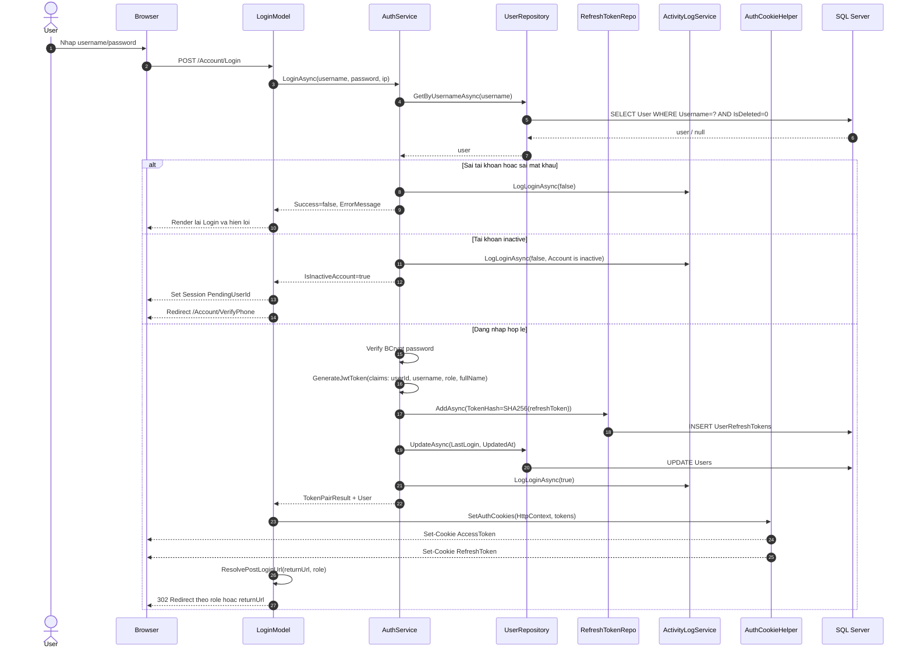
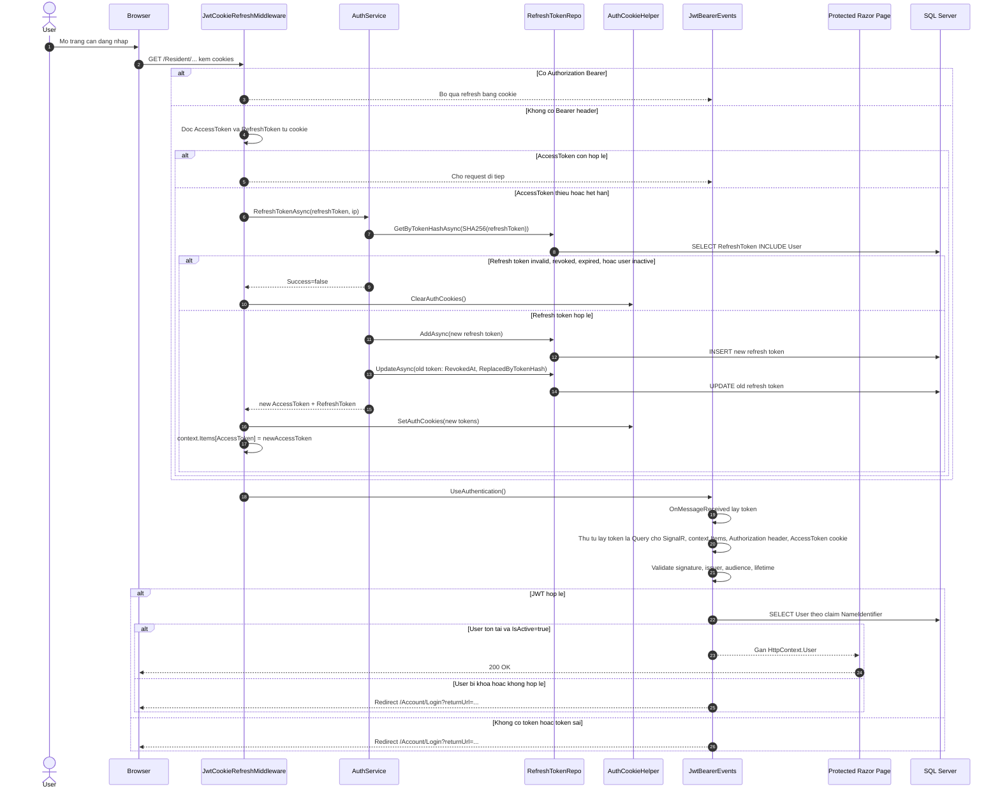
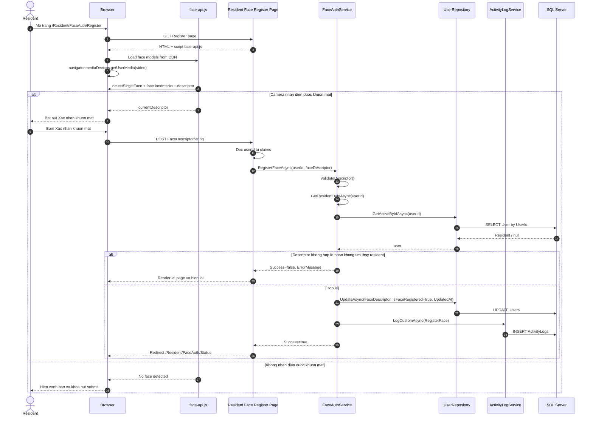
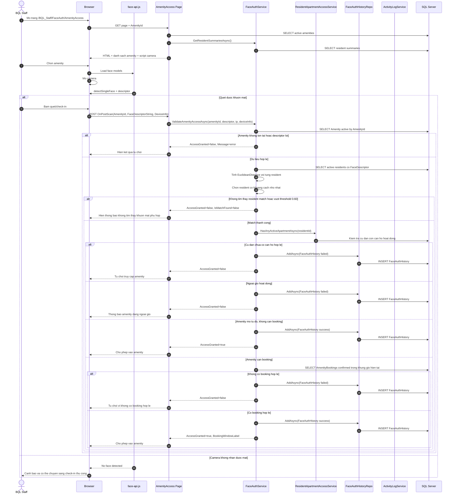

# Sequence Diagram JWT Login

Tai lieu nay mo ta luong dang nhap JWT theo dung code hien tai trong project `PRN222_ApartmentManagement`.

## 1. Login bang JWT

## 2. Request sau khi da login

## 3. Tom tat ngan gon

- Login page goi `IAuthService.LoginAsync`.
- `AuthService` kiem tra user, password, trang thai active.
- Neu hop le, he thong tao `AccessToken` va `RefreshToken`.
- `RefreshToken` duoc hash roi luu DB.
- Ca 2 token duoc set vao cookie `HttpOnly`.
- Moi request sau do di qua `JwtCookieRefreshMiddleware` truoc.
- Neu `AccessToken` het han va `RefreshToken` con hop le, he thong tu refresh token moi.
- Sau do `JwtBearer` validate token va tai lai user tu DB de xac nhan user van con active.

## 4. File code lien quan

- `PRN222_ApartmentManagement/Pages/Account/Login.cshtml.cs`
- `PRN222_ApartmentManagement/Services/Implementations/AuthService.cs`
- `PRN222_ApartmentManagement/Services/JwtCookieRefreshMiddleware.cs`
- `PRN222_ApartmentManagement/Utils/AuthCookieHelper.cs`
- `PRN222_ApartmentManagement/Program.cs`

## 5. Dang ky khuon mat xac thuc

Ghi chu:

- Neu staff ho tro dang ky tai quay, page se la `BQL_Staff/FaceAuth/Register`.
- Khi do service duoc goi la `RegisterFaceForResidentAsync(actorUserId, residentId, faceDescriptor)`.
- Phan validate descriptor va cap nhat `User.FaceDescriptor` van giong nhau.

## 6. Xac thuc khuon mat tai diem amenity

Ghi chu:

- Luong tren la luong quet khuon mat chinh.
- Neu camera loi hoac khong match, staff co the dung `OnPostManualAsync`.
- Khi check-in thu cong, service se goi `ValidateAmenityAccessManualAsync(...)` va co them log `ManualAmenityCheckInApproved` hoac `ManualAmenityCheckInRejected`.
